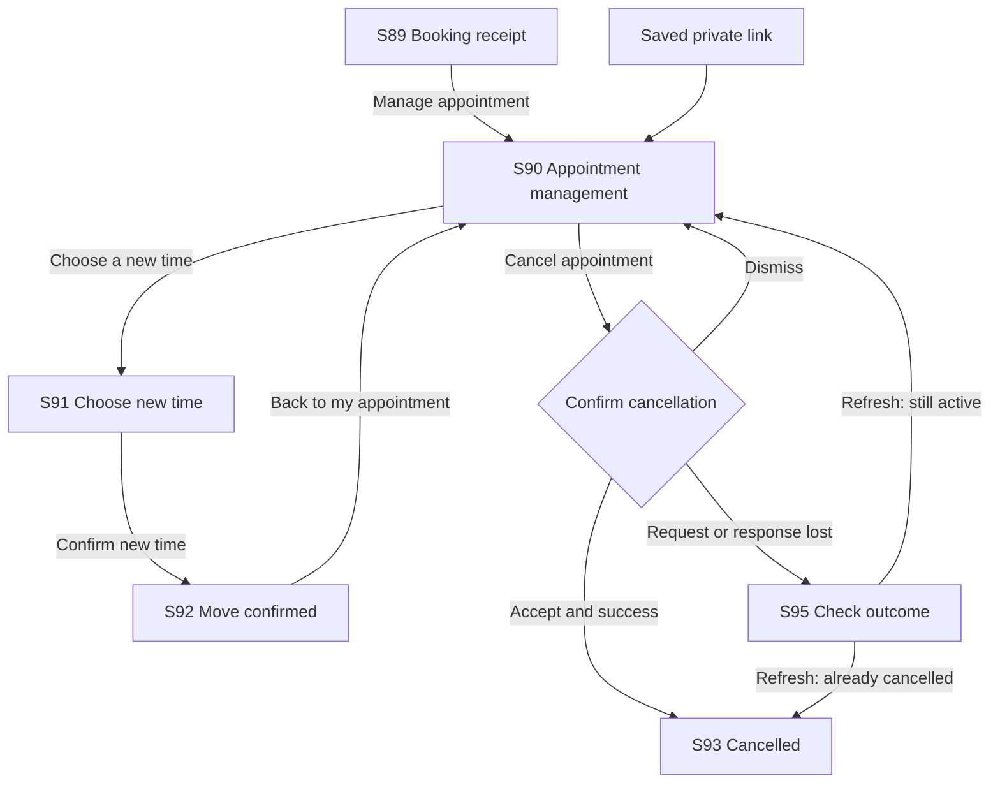
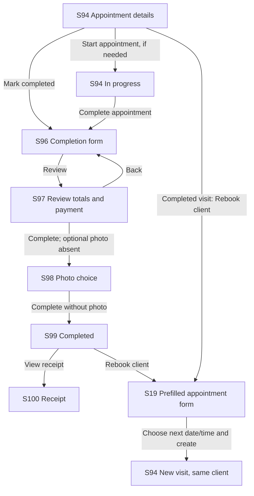

# Luster audit follow-up

## Baseline and boundaries

- Original inventory: 165-page Isla audit, S01–S88 and F01–F10.
- Decision baseline: independent review dated 2026-10-03; accepted follow-up plan in this task.
- Application baseline: `ff03b66b54bf8eb348b70651e54311614e2542f8` (`origin/main`, fetched 2026-10-03).
- Execution branch: `codex/luster-audit-lifecycle`, separate worktree. Primary checkout and existing untracked work preserved.
- Synthetic fixture salon: `nail-salon-no5`. This is not the live Isla salon.
- Database: fresh PostgreSQL 16 cluster, bound to `127.0.0.1:55432`; disposable target and live session attested before migrations/seeding.
- Provider configuration: repository-approved CI placeholders; no real Clerk, Stripe, Twilio, Resend, Google, voice, or media credentials inherited. Shared SMS explicitly disabled. Notifications may be suppressed/failed; neither state proves provider delivery.
- `npm run db:prepare:e2e:ci` and `npm run env:verify` passed. Actual UI checks and persistence verification are separate gates.
- Local test authentication uses the application's supported synthetic super-admin password flow. Impersonated owner views will be identified as such; they do not prove a real owner/staff Clerk sign-in works.

## Evidence corrections to carry into the revised report

1. S06 must show public salon hours, not the Working hours editor.
2. S14 is an alias of S75; S88 is the root entry into S15.
3. F05 client tabs are optional branches, not required steps to Book or Text. Apply the same task-versus-tour distinction to F06–F09.
4. Keep existing policy preview (S13), active/inactive service labels (S35), calendar filter chips and imported times (S32/S33), and optional-feature explanations (S38/S41/S44).
5. A short policy screenshot does not establish a long-policy layout problem (S18).
6. Do not conflate local no-show records with network no-show history (S24/S53).
7. Code inspection confirms a `Find next available` action already exists in public booking. Test its visibility and outcome before specifying another control.
8. S82's two conflicting instructions are present in baseline source. Actual control persistence still needs runtime verification.
9. S84 already has underlying dirty/saving/saved/stale/error state handling. Improve the presented behavior only after exercising those states.

## Required completion matrix

| Package | Required evidence | Status |
| --- | --- | --- |
| Public booking | UI submission, receipt, unique stored appointment, owner/client agreement, reload | Baseline fixture/no-deposit passed in mobile Chromium and WebKit; HTTPS recovery and other variants pending |
| Customer management | UI reschedule, cancellation, back, failure/retry, rebook | Baseline reschedule/cancel passed; reschedule/cancel, both network recovery paths and consistent cancelled badge passed in both mobile browsers; rebook pending |
| Owner lifecycle | Contextual creation, edit, reschedule, start/complete, applicable payment record | Creation, reload, edit, start, cash completion, receipt and rebooking passed in mobile Chromium/WebKit and desktop; alternate entry points and failure branches in progress |
| Booking variations | Solo/team, approval, deposit, conflicts, duration changes, double submit | Pending |
| Services | Ordinary service/add-on save, active state, public result, history preservation | Pending |
| Roles/setup | Onboarding, initial publication, staff actions, tenant boundaries, platform administration | Pending |
| Editor behavior | Immediate/draft scope, save failure, preview, publish, revert, concurrency | Pending |
| Responsive usability | 320/390/430px, 1440px, WebKit/Chromium, keyboard, focus, reflow | Pending |
| Physical device | Actual phone interaction; do not substitute emulation | Pending |
| Audit artifacts | Corrected PDF/source/screenshots/flow maps/coverage | Pending |
| Package A | S82/S84 status, verified S65/S86 corrections | Pending |
| Prototype review | Owner entry/walk-in and Booking Page organization, matched task comparisons | Pending; review before structural implementation |
| Targeted refinements | Public booking, Today, catalog navigation, reminder credits, shared panels | Pending |
| Investigations | Calendar, voice, Gallery, no-show scope, legacy themes, payment prerequisites | Pending |
| Release | Scoped PRs, relevant checks, preview, review resolution, protected-main merge, SHA check | Pending |

## Evidence rules

Record observed defects, design opinions, and unverified questions separately. A skipped test is not a pass. An API action is not a UI walkthrough. A mock or suppressed provider outcome is not external delivery. Keep screenshots of synthetic data legible; preserve old screen IDs and append new ones from S89 onward.

No blanket screen rebuild, new operations inbox, mandatory advanced catalog setup, historical service merging, or universal website-draft transaction is authorized by this register. Structural prototypes retain the existing design-review checkpoint.

## First completed walkthrough (2026-10-03)

The unchanged baseline built successfully. The new UI lifecycle suite passed its synthetic authentication setup and one lifecycle test each in Chromium (390 × 844) and mobile WebKit (390 × 664 viewport, iPhone 13 emulation). The suite selected a future date/time through visible calendar controls, filled and submitted the guest form, reopened the receipt, inspected that same appointment in the impersonated owner calendar, moved the appointment through the guest management UI, dismissed cancellation once, then confirmed cancellation and reopened its terminal state. Database reads attested the disposable target and confirmed one appointment, stable appointment/client IDs, changed start time, and persisted cancellation.

New references: S89 booking receipt, S90 customer management, S91 reschedule, S92 reschedule result, S93 cancelled state, S94 owner appointment details, S95 cancellation recovery. These will be appended to the visual report; no existing reference is renumbered.

### Findings from execution

- **Observed defect, high: cancellation loses recovery on a rejected network request.** A browser-aborted PATCH left the unchanged app on disabled “Cancelling…” indefinitely. The regression reproduced this in Chromium with a screenshot and trace. The fix catches network failures, times out stalled requests, and lets the customer refresh to resolve an uncertain outcome or retry. Server conflict/policy/authentication behavior is unchanged.
- **Observed defect, medium: reschedule result promises email delivery without evidence.** S92 said “emailed you the new details” while the isolated server logged `RESEND_NOT_CONFIGURED`. The route commits the appointment before attempting notifications and does not return delivery evidence. The fix confirms the saved appointment and links to its latest details without claiming email delivery.
- **Observed defect, medium: cancelled action with a stale Confirmed badge.** S93 visually showed both “Confirmed” and “This appointment is cancelled” immediately after the successful action. The stored record was cancelled. Refreshing the server-rendered appointment after successful cancellation keeps the badge and details consistent; the mobile regression now asserts the badge before capture.
- **Environment limitation, not a production defect: HTTP receipt recovery.** The existing recovery URL validator requires HTTPS with no explicit port. On local HTTP, the receipt survives refresh and correctly offers secure lookup instead of the management link. The walkthrough continues using the private link obtained from the original receipt. Hosted HTTPS refresh/recovery remains unverified; the security rule was not weakened.
- **Source-confirmed existing capability:** public Time already includes `Find next available`. Its absence/functionality must be checked in the relevant runtime state before prescribing another control.

Run the dedicated suite against the already-built isolated local server with `npx playwright test --config tests/browser/auditLifecycle/playwright.config.ts`. Set `HOST=localhost` and `PORT` to the already-running isolated application port (3112 for this audit). The suite requires the existing disposable PostgreSQL guard, fixture credentials and a loopback HTTP application, and writes synthetic appointments. It rejects hosted application targets even when a local database is configured. Credentials and runtime environment files are local only. Evidence is stored in `tmp/audit-lifecycle-results`; the final report export will include the screenshots and label remaining limitations.

## Customer management repair verification

The first scoped repair changes customer cancellation feedback/recovery, refreshes the server-rendered appointment after successful cancellation, and corrects the reschedule success sentence. It adds reproducible audit coverage and does not change appointment authorization, cutoff rules, scheduling constraints, provider configuration or database schema.

- Focused component and API integration regression: **97 tests passed across five files**. Includes cancellation dismissal, rejected request, HTTP failure, 15-second timeout, retry, truthful reschedule feedback, and the existing cancellation/rescheduling API constraints. API integration cases run against isolated PGlite; the browser suite separately reads the attested PostgreSQL records.
- Scoped ESLint: passed.
- Production build: passed, including TypeScript validation.
- Mobile UI rerun: **6 scenarios passed, zero skips**, covering the complete scoped journey and both failure modes in Chromium and WebKit. Successful cancellation updates the badge before screenshot capture. S92, S93 and S95 were visually reviewed for readable copy and consistent status; the captures have no horizontal overflow.
- PR #345: all 21 CI jobs passed, no unresolved review threads, exact-head preview READY, merged as `f0346feae1bcb1efb8491d317fc4bd0decaaba1c`. Production was READY and `https://www.lustergel.app/api/health` reported `status: ok`, `gitSha: f0346fe` at 2026-10-03T22:07:26.306Z. Preview health was degraded because Redis/outbound integrations were absent; its root and robots routes returned 200. The lifecycle evidence remains isolated-local evidence, not hosted-provider verification.

The live Isla salon has not been used for mutation or messaging tests. Physical-phone use, hosted HTTPS receipt recovery and actual provider delivery remain unverified.

## F11 — Customer manages an existing appointment

**Role:** guest with the appointment's private management link. **Entry:** S89 receipt → Manage appointment → S90. A saved private link is an alternative entry. Secure booking lookup is a separate, still-unverified entry.

1. On S90, choose **Choose a new time** → S91.
2. On S91, choose an available time and **Confirm new time** → S92. **Keep current time** is a visible cancellation route, but this run did not exercise that branch.
3. Choose **Back to my appointment** → S90. Reload and confirm persisted time using the same appointment ID.
4. On S90, choose **Cancel appointment**. Dismiss native confirmation to keep the appointment, or accept to cancel → S93.
5. If the request fails, S95 explains that the outcome is unknown. **Refresh appointment** reloads the stored status; retry is available if still active.
6. Reopen the original private link to verify the persisted cancelled state.

**Observed strengths:** direct private entry, preserved appointment/client identity when moving, clear return link, and a confirmation before cancellation. **Repairs in this package:** reliable failure recovery, consistent cancelled status, and no unsupported email claim. **Remaining checks:** cutoff errors, expired/invalid links, same-time selection, no-availability recovery, rebooking, payment/approval variations, desktop, keyboard and physical devices. Existing API tests cover several rules but are not substituted for those UI observations.

## Owner appointment follow-up (2026-10-03)

**Baseline:** released main `f0346fea`, separate `codex/luster-owner-lifecycle-audit` worktree. The original local runtime was retained for baseline evidence; the repair runtime uses a separate local port. Both use the attested disposable database. Actual app mutations are synthetic. Cash means a stored payment record in this test, not a real money exchange.

**Fixture clarification:** the seeded salon has its free-solo flag enabled but the owner calendar visibly lists Daniela, Jenny and Tiffany. The owner test explicitly chose Daniela. This is not proof of the one-eligible-technician experience; the single-technician configuration remains a separate case. Owner access is still supported super-admin impersonation, not real Clerk owner/staff authentication.

### Completed evidence

Three final baseline runs passed with zero skips: Chromium at 390 × 844, mobile WebKit/iPhone 13 at 390 × 664 CSS pixels, and Chromium at 1440 × 1000. Each run:

1. Opens Today → New Appointment (S19); enters a date/time, synthetic client, technician and service; submits through the real UI.
2. Reloads, opens Calendar → selected date → appointment (S94), and checks the single persisted appointment and client identity.
3. Uses Edit / reschedule in S94, changes the time, saves, reloads and opens the same appointment ID.
4. Starts the appointment and verifies `in_progress`; opens completion (S96), selects Cash, reviews (S97), goes Back once and returns to Review.
5. Chooses Complete, then Complete without photo in the optional-photo prompt (S98). Checks S99, the persisted completed record, one cash ledger entry and zero balance.
6. Opens the receipt (S100), reloads and reopens the completed appointment. Rebook client opens S19 with the client name, phone, email, service and technician carried over. Saving the next visit creates a second appointment linked to the same client; the prior visit remains completed.

This verifies existing rebooking prefills. Do not specify them as missing functionality. It does not prove calendar-time entry, client-profile entry, walk-ins, staff authorization, tax/deposit variants, partial payment, real provider behavior, or a physical phone. The test uses future appointments to isolate its data; it does not simulate elapsed service time.

### F12 — Complete and rebook a visit

**Role:** owner. **Start:** S94, opened from Calendar after selecting a date and appointment. **Goal:** record the completed service and payment, optionally arrange the next visit.

Receipt and rebooking are optional branches. The test toured both to establish coverage; they are not required to complete a visit. S96 cancellation/discard and S98 Add photo are visible branches still awaiting their own execution.

### Screen decisions and practical critique

| Reference | Evidence and strengths | Recommendation / priority |
| --- | --- | --- |
| S19 | One form, searchable service list, price/duration summary and reachable fixed Create action; working rebook prefills. Mobile requires scrolling between contact and services inside an 80%-height modal, with another scroll area for the services. | Refine-first: prototype a better-sized single form and compact selection. Keep the existing footer and prefills. Medium design issue; not proof that a wizard would help. |
| S94 | Creation and time edits persist; Start and Complete actions work; completed record exposes receipt and rebooking. | Preserve this shared panel. Evaluate error/conflict and keyboard paths before proposing structural change. |
| S96 | Service and totals precede payment. Cash, amount and Review are usable; fixed action stays accessible. | Keep. On shorter mobile views the amount field needs a separate scroll; assess compact totals as a design refinement. Low/medium, not a functional failure. |
| S97 | Review and Back work; going Back does not complete the appointment. | Keep; partial payment and tax/deposit disclosures remain separate checks. |
| S98 | Offers a real choice to finish without an optional photo; completion persists. | Keep optional behavior. Add-photo/upload and required-photo configurations still need execution. |
| S99 | Clear completed/paid result, remaining balance, receipt and rebook actions. | Refine the payment labels: this one cash payment appears under both Other payments and Already paid. The stored ledger has exactly one entry, so this is a wording/hierarchy concern, not duplicate charging. Medium. |
| S100 | Receipt shows service, total, recorded cash payment and zero balance; available after reload. | Keep. A future appointment completed now yields different visit/payment dates in this synthetic test; do not report that as a date bug. |

### Confirmed creation-retry defect

**High, observed, S19 / F02:** the original form generates a new idempotency key in every submit failure handler. A real UI test let the server commit a 201, then dropped only the response. The form showed a raw network error. Retrying the unchanged form produced two confirmed appointments for the same client and start time, assigned to different technicians. Baseline screenshot, trace, request result and attested database evidence are preserved.

The scoped repair retains a request identity for unchanged retries, rotates it when the request payload changes, and explains an uncertain save outcome. Existing server replay and failure-lock release behavior is reused; no scheduling, payment, authorization or database rule is changed. Final browser verification passed all six scenarios with zero skips, including viewport/focus and original-record replay checks in all three projects. Production build, TypeScript and scoped ESLint passed. Hosted preview and release gates are pending. Closing/reopening after uncertainty, Redis outage, expired cache, malformed response and stalled-request behavior remain separate checks; do not generalize the bounded replay test to those cases.

A second **observed defect, medium, S19 / F02** was reproduced with the browser viewport assertion: after submission from the service section, the new error banner had a viewport intersection ratio of zero. Merely asserting that the element existed/was CSS-visible did not establish that the owner could see it. The repair focuses the alert and scrolls it into the form viewport. The regression now checks both viewport presence and keyboard focus before retrying.

Focused component/checkout/API-effect regression: 88 tests passed across three files. The ordinary creation retry keeps its request body/key; editing the failed payload uses a different key; the existing Google-conversion server-failure test now reflects server-side failed-lock release instead of requiring unsafe unconditional key rotation. A clean-environment secret scan passed. Running that scan with the synthetic login environment produced fixture-phone literal matches in existing files; the scanner and those fixtures were unchanged.
