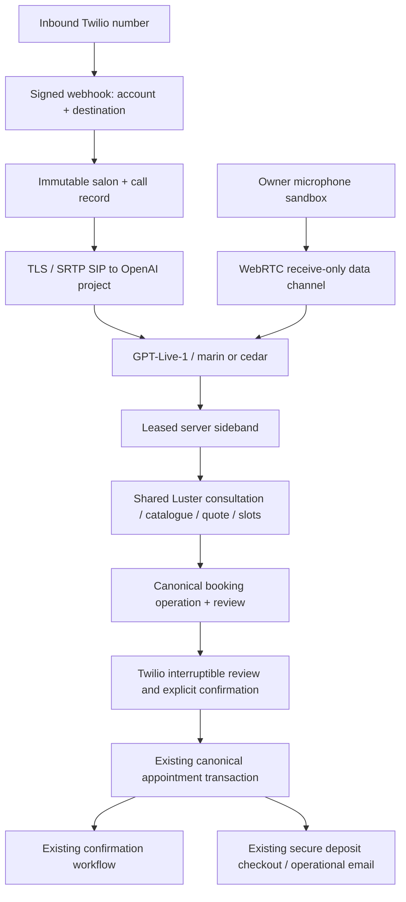

# V1 voice receptionist

This implementation adds a phone channel to Luster's existing Customer Assistant and booking authority. It does not activate billing. Phone answering and phone booking default off. Deploying this code is not evidence that a real call or booking succeeded.

## Architecture and existing work

The branch starts at protected main `68d34d28a76ea93a01ecef7fc4670454af166514`, including the newer Customer AI manual-price/removal work. The historical phone assessment identified an n8n greeting/hangup flow and generic follow-up messaging, not a booking receptionist. This implementation replaces that path only after the target number/account is verified and the operator authorizes its routing change.

`authority.server.ts` reuses Customer AI's catalogue, bounded interpretation schema, `resolveCustomerTurn`, proposal/readiness rules, availability, `prepareCustomerBookingQuote`, durable booking operation, and `confirmCustomerBooking`. It passes the real salon settings into tax/deposit/network-risk decisions. Authoritative manual-price and starting-price labels survive into the voice review. No parallel prices, duration rules, deposit engine, or appointment creator is introduced.

GPT-Live handles natural speech and interruption. Its client-delegation event contains no function arguments or complete utterance. Unambiguous clarification/contact/slot replies use deterministic handling; remaining semantic turns use one bounded `gpt-5.6-luna` interpretation using the existing Customer AI schema. There is no separate prose-generation model. `interpreterCalls` measures fallback frequency; do not claim that a second model is exceptional until representative real calls establish that.

Caller ID only suggests a callback number. Name, email and callback number are read back for confirmation. Text reminders preserve Luster's existing salon default, which the final review discloses with STOP information when enabled. Only an exact, high-confidence, signed Twilio correction can record an explicit reminder preference; partial Live speech cannot opt a caller in. A callback-number change clears any prior explicit preference, and salon-level disabled messaging stays authoritative. Card details are rejected; the caller uses the existing secure checkout link. Deposit mail validates the actual canonical email recipient against the operation-bound confirmed contact.

## Booking consent and recovery

Live transcript fragments are not reliable end-of-turn or playback-completion events. They never authorize a phone booking. The server switches the same parent call to a deterministic Twilio checkpoint:

1. The first Gather reads the authoritative summary, price qualifiers, total, deposit and required policy. Any recognized speech/DTMF during this summary takes the correction path; this endpoint cannot create a booking.
2. With no interruption, a separate Gather asks for explicit booking confirmation. Signed, finalized speech must match an explicit phrase such as “yes, book it” / “sí, reserva la cita” with confidence at least 0.8, or the caller presses 1. General “yes” is insufficient.
3. A phase-scoped HMAC binds account, parent call, salon, checkpoint, operation revision/fingerprint and expiry. The freshly leased state is revalidated before enqueueing work. Twilio immediately receives waiting/redirect TwiML while Next `after` awaits booking work.
4. The canonical appointment transaction fences the active call lease and enabled booking permission before and after mutation. Retries use the same durable operation. No new operation is created to resolve an ambiguous commit.
5. Status polls cannot book. Crashed workers reconcile only positively linked canonical appointments; an empty unlocked snapshot is left unresolved. Parent hangup revokes the call; ending only the SIP leg during the checkpoint does not.

A change of service, length, design, time or contact invalidates the old review. Interrupted preparation retains the durable operation revision while rejecting its stale result. Corrections resume from the saved consultation and require a fresh review. No confirmed appointment cancellation/reschedule capability is exposed in V1.

**Controlled-call activation gate:** prove actual Twilio behavior for interrupted/unintelligible/noise/empty first-Gather input. An interrupted incomplete summary must never fall through into booking confirmation. Synthetic tests cannot establish this provider/audio behavior. Also test response during the final Gather prompt. The final checkpoint currently uses Polly Joanna (English) / Lupe (Spanish), so there is a brief voice change from the conversational voice.

## Owner UX, limits and privacy

Settings → Messages → Phone receptionist provides answering and booking switches, greeting, marin/cedar, automatic/English/Spanish language, always/after-hours answering, callback handling, recent outcomes and appointment links. The microphone sandbox has audio playback, temporary captions, and explicit stop; it cannot create appointments, payments or messages.

The pilot limit is two active calls and 32 calls/day per salon, with a 10-minute original call deadline that does not reset on reconnection. The sideband uses a renewable lease, bounded reconnection and an awaited maintenance recovery job. Runtime requires a Vercel plan supporting `maxDuration=800` and Fluid Compute. The linked team was verified as Pro on 2026-09-22; deployed execution still needs controlled verification.

Luster stores no call recording or full transcript. Active structured consultation/contact state is needed for recovery. Terminal state removes contact from the draft; the confirmed callback number, concise outcome summary and metrics remain for 30 days. Maintenance reaps orphaned calls, preserves unresolved operation references for reconciliation, and clears retained call data after 30 days. Provider account logs/retention must be reviewed separately; `store:false` does not make a claim about all provider retention. Do not log raw webhooks, transcripts, SDP, capabilities or credentials.

## Provisioning and deployment

Required server-only environment variables are documented in `.env.example`. Use a dedicated OpenAI project/key and voice Twilio account credentials. The existing Customer/Owner AI keys, SMS account and billing flags are independent.

1. Run checks and review the PR on its final SHA. Apply migration `0090_voice_receptionist` through the guarded environment-specific command. Production requires the verified backup and confirmation controls in README; do not deploy a newer migration tail against an older database.
2. Verify the Vercel plan/runtime. Configure canonical HTTPS `VOICE_RECEPTIONIST_WEBHOOK_ORIGIN`, a random signing secret of at least 32 characters, OpenAI voice project/key/webhook secret, and the verified Twilio account SID/auth token. Do not put values into chat or commit them.
3. In the OpenAI project, configure the signed incoming Live transport webhook to `https://www.lustergel.app/api/voice/openai`. Use the same project for the SIP address, key and sideband.
4. Verify the exact existing number in Twilio and associate `(account_sid, phone_number)` with the correct salon in `voice_number_route` through an operator-reviewed database change. Owner clients cannot edit number routing. The inspected accessible account owns only the number ending 9444; Isla's historical 9891 ownership is not yet verified. Do not replace the 9444 n8n webhook as a substitute.
5. First enable only `VOICE_RECEPTIONIST_SANDBOX_ENABLED=true`; exercise owner microphone consultation on a controlled salon. Phone and booking remain off until this passes.
6. For a controlled number/test salon, set incoming Voice URL to `https://www.lustergel.app/api/voice/twilio/inbound` (POST), and parent-call status callback to `https://www.lustergel.app/api/voice/twilio/status` (POST). The app produces the authenticated SIP leg and its dial-ended callback. Leave recording disabled.
7. Enable `VOICE_RECEPTIONIST_ENABLED=true`, then the intended salon's answering switch. Test questions/alternatives/interruptions with booking permission off. Verify account + destination isolation and that owner Off stops answering.
8. Enable booking only for a safe test salon with controlled recipient and test-mode deposit configuration. Verify synthetic booking, retry, dropped-call, payment link, network-risk deposit and normal confirmation behavior. Never use real customer recipients or real charges as test data.
9. Only after those pass, enable the Isla pilot. Preserve the previous number configuration for immediate rollback. Other salons remain off until separately provisioned and verified.

Do not merge/deploy a migration-bearing release without database access for the guarded migration. Current local access exposes neither the production database secret nor the required voice OpenAI credentials. Live setup also requires access to the account actually owning the Isla number.

## Verification and scripted call examples

The unit/integration tests cover authority binding, pricing qualifier preservation, tenant-scoped storage and leases, explicit consent, signed callbacks, retry paths, interrupted preparation, canonical recovery and actual-recipient email validation. The PostgreSQL canonical concurrency suite additionally tests final execution-fence rollback; it requires the repository's attested disposable PostgreSQL target. Browser microphone tests use fake media/peer connections, not recorded real audio.

These are **scripted expectations, not transcripts of completed phone calls**:

> AI: Hi, I'm the AI receptionist for Isla Nail Studio. How can I help?
>
> Caller: I want Gel-X for Saturday.
>
> AI: [Uses Luster's supported consultation questions and current catalogue.]
>
> Caller: Medium, with French. I don't know what's on my nails.
>
> AI: [Explains the supported removal/manual-confirmation option returned by Luster.]
>
> Caller: Actually make them short. Anything earlier?
>
> AI: [Updates length, re-quotes and checks real earlier slots; does not restart contact collection.]
>
> Caller: Four please.
>
> AI: [Matches only a unique offered time, collects and reads back contact, then reads the current complete review.]
>
> Caller: Yes, book it.
>
> AI: [Reports canonical confirmed / awaiting approval / deposit pending state, never an invented success.]

> Caller: Quiero reservar para el sábado.
>
> AI: [Continues naturally in Spanish.]
>
> Caller during review: Perdón, mi correo es otro…
>
> AI: [Revokes the old checkpoint, confirms the corrected email, and obtains a fresh complete review and explicit booking confirmation.]

Latency fields distinguish sideband attachment, first observed output transcript, transcript input-to-output gap, tool duration, booking/delivery time, and provider-confirmed usage. Transcript timing is not proof of speaker playback timing. Actual speech detection/model/audio latency and p50/p95 require controlled microphone/phone measurements; none is asserted from mocked tests.

## Estimated provider costs

Checked 2026-09-22: [GPT-Live-1](https://developers.openai.com/api/docs/models/gpt-live-1) costs US$0.05 per voice minute, billed per second, plus backend usage. [Twilio Canada](https://www.twilio.com/en-us/voice/pricing/ca) lists US$0.0085/min local inbound, US$0.0040/min SIP, US$0.02 per default speech Gather and US$1.15/month local number rental; TTS is additional.

A conservative illustrative four-minute call with four Live minutes and two Gather uses is about US$0.29 before TTS, interpretation tokens, hosting, messaging, taxes and number rental: `4 × (0.05 + 0.0085 + 0.004) + 2 × 0.02`. Actual SIP/Live duration ends during the Twilio checkpoint, and carrier billing increments/provider invoices govern final cost. This is an estimate, not a measured pilot invoice.
