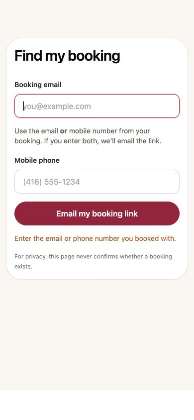
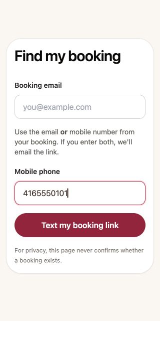

# Find my booking accessibility — Q02 / F11 / S133

Reviewed 8 October 2026 from current protected main ab3aee24 in its own clean task worktree.

## Current-main integration — 10 October 2026

This task now includes protected main `3bd6b1eb6208f1e09886726ae86e456e8dfd15ab`. The newer premium recovery-screen design is preserved, including its icons, input styling, privacy copy, busy state and accessible guidance. The remaining prepared behavior focuses Booking email on empty submission and clears an obsolete empty-contact warning when either contact is entered. Server failures stay visible until explicit retry. Historical screenshots below predate the visual redesign and document the original accessibility investigation; they are not the current visual specification.

Fresh focused checks passed 362 tests on each of Node 20 and Node 24. The combined standard-entry and customer-recovery browser suites passed 77 Chromium/WebKit cases. Current-head build, hosted gates and Preview/release evidence are tracked in the pull request.

## Change

The existing form connects its alternative-contact guidance to both inputs. Empty submission now exposes an alert, marks the shared requirement invalid and focuses Booking email. Either nonempty contact clears only the obsolete empty-contact warning; whitespace does not. Failed-request alerts remain while editing, until explicit retry. The existing neutral accepted message has a status role. IDs remain unique for multiple form instances.

API, email precedence, native email validation, publication and phone-privacy gates, token classification, contact lookup and provider behavior are unchanged. No additional recovery step or visual system was added.

## Evidence

- Unchanged-component baseline with new assertions:7 expected failures, 7 passed.
- Component/page/manage/recovery API regressions:83 passed across 6 files; token classification:4 passed. Total 87.
- Existing customer-assistant/recovery browser suite:56 passed, including 10 new cases in Chromium/WebKit. Coverage includes 320px at 200% text, 390px and 1280px wide viewports, Enter-to-submit/focus, field descriptions, native invalid email, server failure/edit/retry and neutral acceptance.
- Direct scoped lint:0 errors, 0 warnings after formatting corrections.
- Optimized production build passed on retry using approved synthetic CI provider values. Explicit route generation and TypeScript also passed.

Actual local browser screenshots show the real component inside the repository's existing isolated page fixture. Empty submission focused Booking email and made both descriptions reference the error; a synthetic phone value cleared only that warning. No API request or customer message was sent during the manual walkthrough. Both widths have matching document/viewport widths. The fixture wrapper is not a full production route capture.

## Limits and retained failed attempts

The tests restrict provider transport to loopback fixtures. Accessibility role/description/focus assertions do not prove physical screen-reader output. Controlled recovery delivery and physical phone acceptance remain B03/B05. Hosted Preview, CI and production release are pending.

The initial local build failed with ENOSPC. Only three regenerable compiler caches from this and two completed goal worktrees were removed, recovering about 4 GB. Source, dependencies, logs and historical evidence were preserved. Original failed build and retry logs remain in the local review evidence. Full browser tests also regenerated 24 unrelated captures; they were preserved with a SHA256 manifest outside the checkout, and only the five tracked generated images were restored to HEAD. No unrelated image is included in this PR.

The initial dependency-lock comparison failed because of automatic root-version metadata; a normalized comparison confirmed identical dependency graphs before ignored dependency links were created. Initial lint reported 9 formatting errors and 1 conditional-test warning; these were corrected without weakening assertions or retries. A nonexistent extra token test filter selected nothing; the actual 4 token cases were subsequently run by their discovered filename. All counts above refer to selected, completed tests.

No schema migration or provider configuration is required for this correction. Rollback is a normal revert of the scoped change.

## Current-main refresh — 9 October 2026

Refreshed without conflicts from protected main `5b0ff4605b815ffd572aed9d749b9bf550964c92`. The original failed hosted run remains retained; its unrelated SettingsModal follow-up is now included through main. Fresh matching CI and a published synthetic Preview recovery screen are still required before release.

The same 87 selected tests pass on Node 20.20.2 and Node 24.19.0. The customer-assistant/recovery browser suite passes all 56 Chromium/WebKit cases. Two existing rescheduling financial-presentation tests previously finished before their mocked availability response settled on Node 24: both failed in two isolated runs there, while passing twice on Node 20. They now await the visible empty-slot result before checking the unchanged financial assertions. No application logic, timeouts, retries or console-failure checks changed. Original failure logs are preserved.

The prior shared dependency link and all generated browser captures were preserved outside the checkout. This branch now uses an isolated copy of the current installation, with matching package and lockfile hashes. No dependency definition changed in this PR.

Fresh production build, route generation, TypeScript, scoped/project lint, 19 repository guards, protected-surface checks, secret scanning, commit validation and whitespace checks passed. The original failed run is separate from these completed results. Hosted full-route, physical-phone and provider acceptance remain subject to the limits above.
