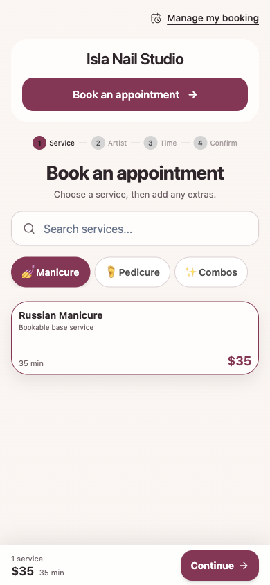
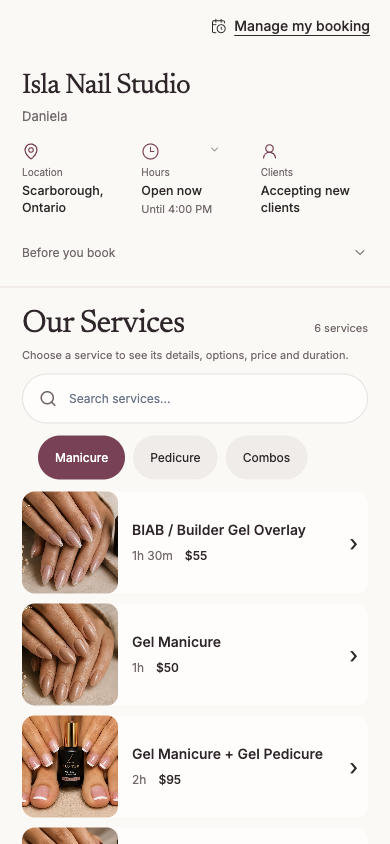
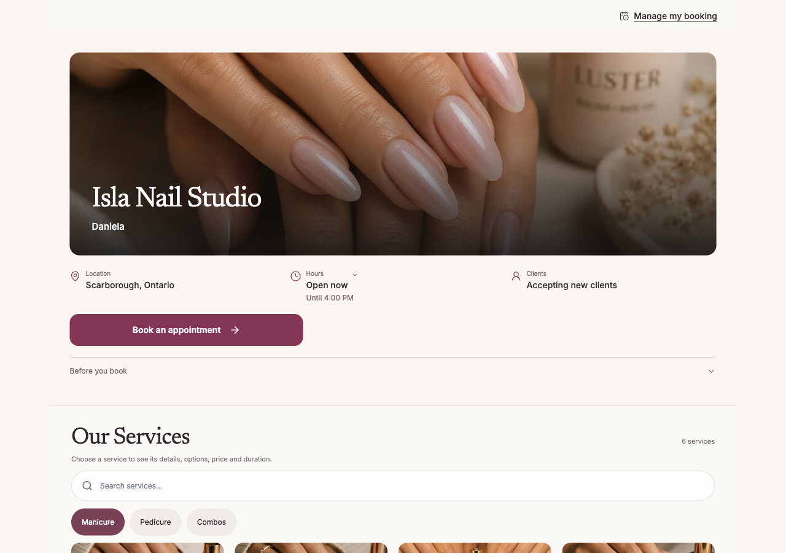

# Booking recovery entry — Q02 / F11 / S133

## Observed gap

The published isolated salon on Preview `d2103d1d` rendered its standard service
selection page without a booking-recovery link. Its `/find-booking` route worked.
The tenant footer supplies that link only when `freeSoloEnabled` is true, so it
cannot be the only entry for the standard service page. Isla's custom page
already has its own header and footer links.

## Change

The standard service page now includes a quiet **Manage my booking** link before
the salon content. It uses the existing type, palette, icon and spacing system,
has a minimum 44px touch target and a visible keyboard-focus outline. It is a
native link to the existing recovery route, using the resolved salon and locale.
French pages use **Retrouver ma réservation**.

Current flow: Service selection → Manage my booking → existing recovery form.
This entry does not require selecting a service or signing in. The existing
recovery privacy, authorization, rate-limit and delivery behavior is unchanged.
It does not carry contact details, management tokens or booking selections into
the recovery URL. Isla retains its existing two links and receives no extra row.

## Review images

These are actual renders of the local isolated presentation fixture. Its display
name is “Isla Nail Studio,” but its slug is `theme-fixture`, so these images show
the **standard layouts**, not the approved custom `isla-nail-studio` page.
The real component, providers and CSS run with synthetic service data.

### Standard layout, 390px

### Compact layout, 390px

### Media layout, 1280px

## Verification

- Regression reproduced before implementation: the standard and localized link
  assertions failed; Isla preservation and absent-salon cases already passed.
- Focused coverage includes the service page, Editorial, hidden sections, Isla
  and existing URL construction. 165 checks passed on each of Node 20 and Node 24.
- 21 targeted browser checks passed across desktop/mobile Chromium and mobile
  WebKit. They cover 320px/390px touch targets, tenant-scoped destinations,
  keyboard navigation and preservation of Isla's two existing links.
- Manual inspection covered 390px standard/compact layouts, 1280px media layout
  and 320px with 200% text. The enlarged link wraps, grows and stays within the
  viewport. All temporary viewport/font overrides were restored.
- No live customer, message, payment, ledger or account change was performed.
- Production build, typecheck, scoped/project lint, 20 repository guards and
  whitespace checks passed. Existing lint warnings remain unchanged.

This change is prepared locally and is not released. Hosted CI, exact Preview
acceptance, current-main and review gates remain required before merging.
Fixture navigation verifies the link URL; actual deployed-form acceptance
remains a separate release check.

## React review

The entry uses existing render context and a native anchor; it introduces no
state, effect, data fetch, dependency, authentication branch or shared mutable
request data. Decorative icon content is hidden from assistive technology.
The existing tenant route helper is reused instead of building a second URL
system. No business data or owner-configured content is added to the page.
