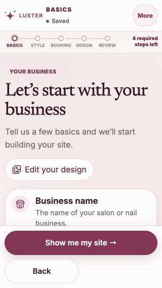
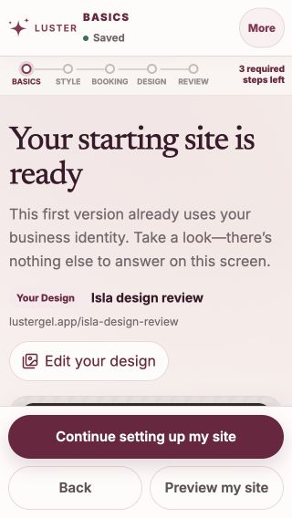
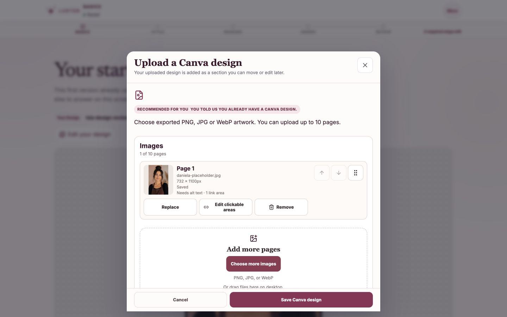

# Your Design recovery — F16 / S131–S132

## Scope

This update starts from `origin/main` at `2f057976260b83108af6193517b1d1cc0bd4ab6c` in a separate clean worktree. The original Desktop checkout is preserved.

The prior audit identified two pre-account recovery gaps: cancelling the first upload offered no immediate way to reopen it, and switching from Full Website or Quick Book created a custom-design section without tracking its identifier. The latter opened the older uploader without clickable-area controls.

- Business details and the starting-site preview now expose one Add/Edit your design action for the Your Design starter.
- Re-selecting the current Your Design starting point reopens its existing editor.
- Starter switching tracks the section already created by the starter. Confirmed artwork remains preserved exactly once, using the existing copy path.
- Older empty drafts recover only when there is exactly one unambiguous empty design section. Missing saved artwork or multiple untracked sections cannot silently select a replacement.
- The existing image manager, clickable-area editor, storage and account integration remain in use. No database or provider configuration changes are required.

## Evidence and checks

Local checks on 2026-10-08: 1,408 onboarding tests, 305 production-integration tests, 27 layout/design-recovery browser cases and 17 existing geometry cases passed. Both the lab and production builds and TypeScript checks passed. Scoped lint has zero errors and 23 existing warnings. Secret and whitespace checks passed. All provider values for the production build were synthetic CI placeholders; no live provider or database was used. An initial build correctly failed before compilation because the CI environment marker was missing; that original log is retained.

The new browser cases cover cancellation, switching from both other starters, upload, a saved clickable area, reload, same-starter re-entry, 44px recovery actions and horizontal fit on desktop Chromium and 390px/320px WebKit. The existing required layout-preview command includes these cases.

Manual browser inspection used an isolated loopback draft and the repository's existing `daniela-placeholder.jpg` fixture. Image upload, creation of a booking action, save, reload and reopening the same image/action succeeded. No salon account, real booking, message, payment or credit grant was submitted. The fixture photo is test material, not a new Isla page design.

Original failed test attempts remain in dated local evidence: a setup helper used the wrong arguments; browser selectors incorrectly required an exact starter-card name and did not account for the existing Edit clickable areas label; a focus assertion did not await the existing animation-frame restoration. Those harness mistakes were corrected without loosening application behavior, assertions, timeouts or retry policy.

## Actual browser captures

At 320px both recovery actions measured 44px high and the page scroll width matched the viewport. These are local implementation captures; they do not by themselves establish a hosted release or cloud persistence.

### Business details after saving and reloading

### Starting-site preview

### Existing manager opened from the starting-site preview

## Remaining acceptance

New-owner account claim, cloud media acceptance and physical-phone/screen-reader review remain separate tracked acceptance work. CI, Preview and protected-main release must pass before this change is called live. Rollback is a normal revert of this scoped UI/state patch; no migration is introduced.
