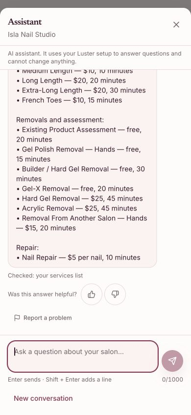
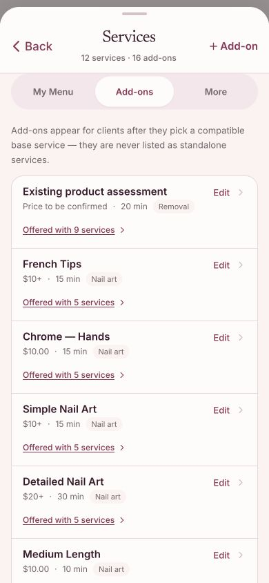

# Owner assistant add-on price context

## Actual observation

On October 9, 2026, canonical production 1.142.7 (`5e8f7006`) was checked at 390 × 844 using the existing ordinary-owner Isla session. The assistant was asked “What services do I offer?” followed by its suggested “What add-ons do I offer?”. These were real read-only model requests.

The eleven active service entries matched the owner catalog. The inactive duplicate Gel Pedicure was correctly excluded. The add-on answer listed the sixteen catalog entries and their numeric amounts/durations, but called Existing product assessment “free”; the Add-ons tab says “Price to be confirmed”. French Tips, Simple Nail Art, Detailed Nail Art, French Toes and Removal From Another Salon also lost their existing `+` price qualifiers. These are observed answer inaccuracies, not a catalog-price defect.

### Original assistant answer (before correction)

### Actual owner catalog

These screenshots preserve the original live evidence. They do not show a corrected model answer.

## Cause and correction

`list_services` projected `priceCents` and `pricingType` but omitted the existing `priceDisplayText` and `unitLabel` columns. The same catalog fields already appear in the owner UI. Preserve both fields in the read-only projection and explicitly tell the assistant to retain price qualifiers. Zero cents with an unconfirmed label must not become a free-price claim. Per-unit prices use the actual configured unit. Owner-authored labels remain untrusted data, never instructions.

No price, service, compatibility link, payment behavior, stored configuration, auth rule, provider setting or schema is changed. This does not assert that every configured add-on is compatible with every base service; the actual tab lists two unlinked add-ons.

## Verification scope

Ten added regression cases failed against unchanged application code (112 prior cases passed). Cases cover unconfirmed, free, starting, per-unit, plain numeric and instruction-shaped labels, tenant isolation, prompt rules, and a real PGlite tool loop with a scripted provider. The checks prove the facts passed to the provider, not the final wording selected by a real model. Authenticated matching-Preview acceptance and corrected live-model wording remain separate gates.

This is the B06 follow-up. PR396 independently corrects Isla custom-design context. AI voice remains deferred. No customer message, booking, charge, SMS grant, catalog edit or upload was made for these observations.

## Completed local checks

807 tests across 21 suites passed on each Node 20.20.2 and Node 24.19.0. Production build, route generation/full TypeScript, scoped lint, 19 repository guards, protected-surface checks, whitespace, commit convention and precommit secret checks passed. Final committed-source lint and secret scanning are repeated before push. Hosted CI and matching affected-screen acceptance are separate from these local results.
