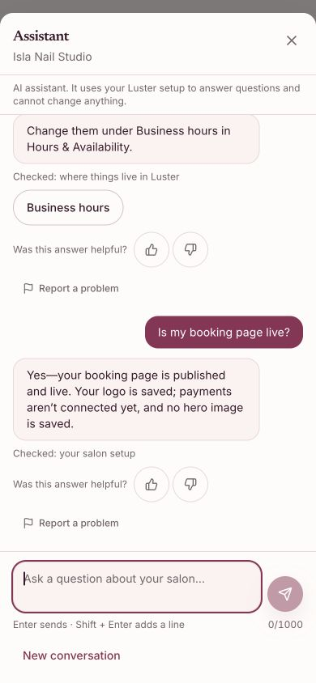
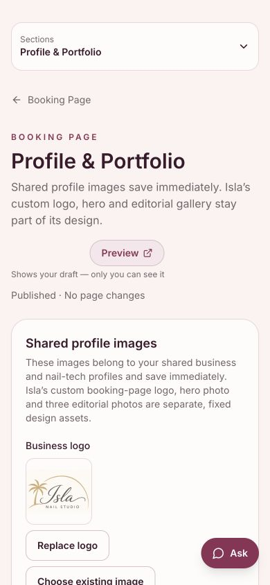

# Isla custom-page guidance in the owner assistant

## Observed in production

On 9 October 2026, canonical production `5e8f7006` (1.142.7), the existing ordinary Isla owner session answered three read-only questions at 390px. No password was entered.

- Logo guidance opened the correct gallery route, but its button said **Photos & Gallery** while Isla's editor heading was **Profile & Portfolio**.
- Business-hours guidance reached the correct Hours & Availability editor; no field was changed.
- “Is my booking page live?” correctly reported publication but also said **no hero image is saved**. That describes an empty standard-template field without explaining the fixed hero already present in Isla's custom design.

These are actual production screenshots from before this correction, not screenshots of a corrected live answer. The payments phrase was not independently tested here and is not part of this fix.

## Correction

The overview retains the accurate saved-upload booleans and separately describes Isla's fixed logo, hero, introduction and editorial gallery. It uses the same `isIslaBookingPage` selector as the public renderer. The trusted salon frame carries those facts even on a navigation-only turn; prompt rules distinguish them from editable template fields.

Navigation search and returned link labels reuse `getBookingPageEditor` for Isla. Destination keys, URLs and ordinary salon labels remain unchanged. The route-resolved slug determines context; model arguments cannot change the salon.

## Verification

Eight new assertions failed against the original implementation; 169 assertions passed in that baseline run. The corrected focused selection passes 809 tests across 21 suites on each Node 20.20.2 and Node 24.19.0. It includes actual PGlite-backed projections and turn orchestration with a scripted provider, route authorization, model-argument isolation, privacy, conversation, budget and unchanged Isla presentation tests. Twelve regression cases were added overall; not every guard case was expected to fail on the original source.

Build, lint, type checks and required hosted checks are recorded with the pull request. A scripted provider proves the facts and link labels delivered through the application; it does not prove the wording a real model will choose.

## Release and acceptance

This branch does not change the booking-page design, authentication, prices, credits, providers, migrations or stored salon settings. Three live assistant answers were observed to find the issue; all correction tests use controlled data and mocked providers. No client message, appointment, payment, upload or credit grant was made.

Before release, verify the matching Preview in an approved isolated owner session. After release, repeat the logo and page-status questions on the canonical site. B06's service/follow-up, availability and recovery checks remain separate; these three questions do not close the full assistant acceptance matrix.

Rollback: revert this scoped source change through the normal protected-main workflow.
