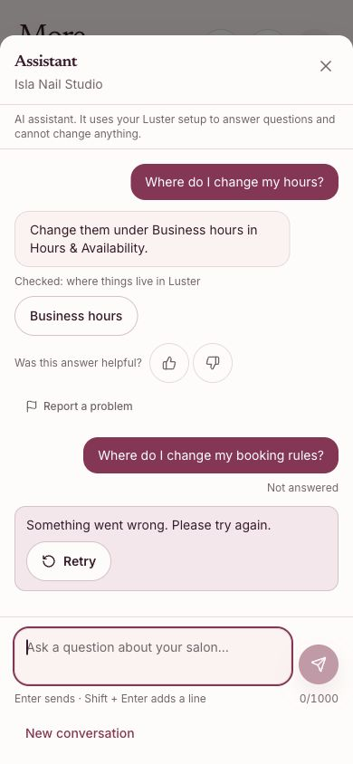
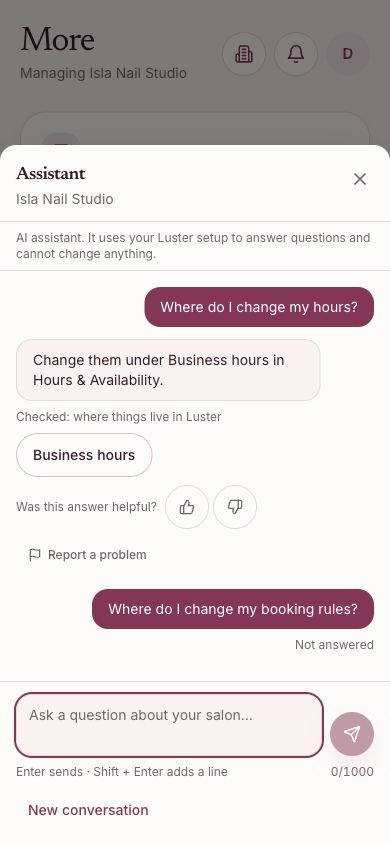
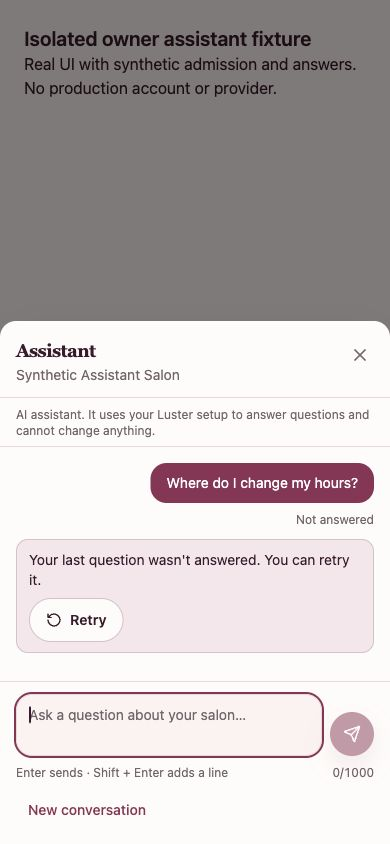
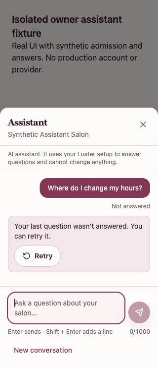

# Owner assistant: restore Retry after reload

## Actual production evidence

On October 9, 2026, canonical Luster at `5e8f7006` was exercised in an ordinary owner session at 390 × 844. Only the chat endpoint was blocked in a temporary tab to simulate connection failure. Each block was removed immediately, and the tab/network override were cleaned up. No customer message, booking, setting, payment or credit grant changed. The visible SMS balance remained 52 before and after.

One failed question offered Retry. Restoring networking and pressing it issued one request, returned HTTP200 and produced one answer without duplicating the question. A second failed question was preserved across reload, but its Retry action disappeared.




These are original production captures before the fix, not local mock screenshots.

## Scoped correction

After existing owner admission, recover only a trailing owner question with no answer. Keep its latest completed signed conversation, show Not answered and explicit Retry, and do not automatically resend. Preserve current model-unavailable reasons, different-owner isolation and salon-switch/New conversation clearing. Recover an interrupted pending question too, even if it had no opportunity to store an error marker. Never target an older unanswered question followed by a newer answer.

## Verification

Eight added unit cases: reload after failed follow-up, interrupted first turn, two ownership rejection cases, current model-unavailable reason, older failed question followed by an answer, New conversation, and salon switch. Before the fix, five failed and 27 cases passed in the launcher suite. After the fix, both assistant UI suites pass all49 cases.

The isolated browser fixture uses the real UI with synthetic context and scripted answers. Three scenarios cover failed request/reload/explicit retry, interrupted-question recovery and different-owner rejection at320px,390px Chromium/WebKit and1440px desktop. It does not authenticate a real owner or call a real provider.

```sh
node node_modules/vitest/vitest.mjs run src/components/admin/ownerAssistant
node node_modules/@playwright/test/cli.js test --config tests/browser/ownerAssistant/playwright.config.ts
```

Full source checks and hosted acceptance are recorded in the pull request. This change does not establish server-side model cancellation, provider-outage recovery or real-phone usability. An approved isolated owner is still needed for authenticated Preview acceptance. No production release is claimed here.

## Isolated visual verification after the fix

The local real component was exercised with a synthetic API at390px and320px: blocked request, reload, reopen, explicit Retry, one successful answer and composer focus restored. The320px view has no document overflow and a44px Retry target. These captures are local fixture evidence, not authenticated Preview or production acceptance.



