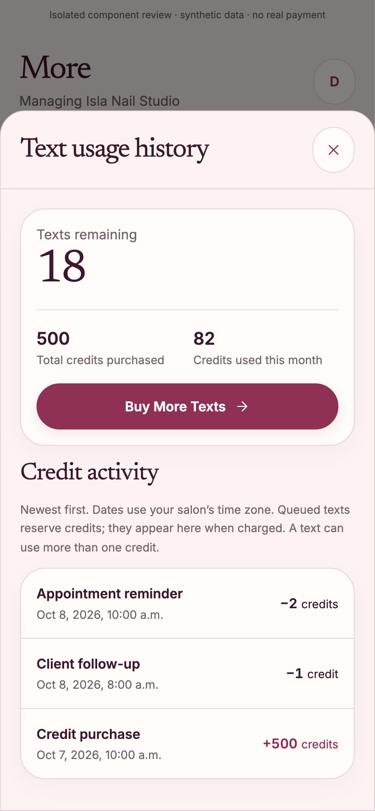
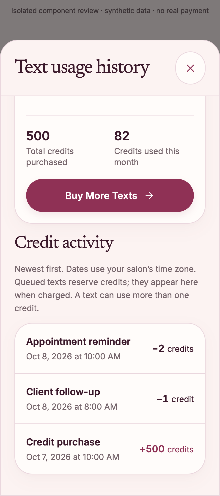

# SMS history singular credit copy — Q03 / F08 / S129

## Change

The existing SMS history used “credits” for every activity amount. Display `credit` when the absolute amount is one, so both `+1 credit` and `−1 credit` read correctly. Other amounts retain `credits`. This is a presentation-only correction in the existing modal; signs, numbers, activity categories, summaries, history requests, authorization, credit accounting and payment behavior are unchanged.

## Evidence

- Fresh worktree started at protected main `ab3aee244d002ce4343b53a014cccecd63325cdd`, before the automatic version-only release commit.
- Regression baseline before the UI correction: 2 failures (positive/negative one), 16 passes.
- Corrected implementation: 56 selected component, status, credit-overview and tenant-authorized usage-route tests passed.
- Seven new amount cases cover positive and negative one, two and ten thousand, plus the existing zero display. The zero case checks defensive rendering only; it is not a new zero-value ledger policy.
- Existing browser suite: all 27 cases passed at 1440px Chromium, 390px Chromium and 320px WebKit. Assertions now verify the history debit/purchase labels as well as the existing balance thresholds, empty/error recovery, package display, last purchase, Today shortcut and simulated successful-purchase refresh.
- Scoped lint passed with no errors or warnings; production build, explicit route type generation/TypeScript check, whitespace and generated-client secret scan passed.

## Screenshots

These show the real production component in the existing isolated browser fixture with clearly marked synthetic data. They are not screenshots of a live salon or proof of Stripe payment, credit grants, email delivery or hosted authenticated acceptance.

390px Chromium:

320px WebKit, scrolled to the activity entries:

## Release and acceptance

Prepared change only at this documentation checkpoint. Relevant hosted checks, authenticated Preview acceptance, protected-main merge and matching production verification are separate release gates. Existing paid-SMS activation remains B08; this copy correction does not enable payments or change the founding free-credit offer.

Original screenshots and logs: `/Users/me/Documents/Codex/2026-10-08/sms-credit-copy/`.

## Current-main refresh — 9 October 2026

Refreshed without conflicts from protected main `5b0ff4605b815ffd572aed9d749b9bf550964c92`. The same 56 selected tests pass on both Node 20.20.2 and Node 24.19.0; all 27 browser cases pass. The production build and 19 repository guards pass. Fresh mobile screenshots are retained under `refresh-2026-10-09/screenshots/` in the evidence directory above.

The original shared dependency link was preserved before creating an isolated copy of the current installation, whose package and lockfile hashes match this branch. No dependency definition or payment configuration changed. Fresh hosted CI and authenticated Preview acceptance remain required; B12 and paid-SMS acceptance B08 are separate from these local fixture results.

Route generation, TypeScript, scoped/project lint, protected-surface checks, secret scanning, commit validation and whitespace checks also passed on the refreshed source.
